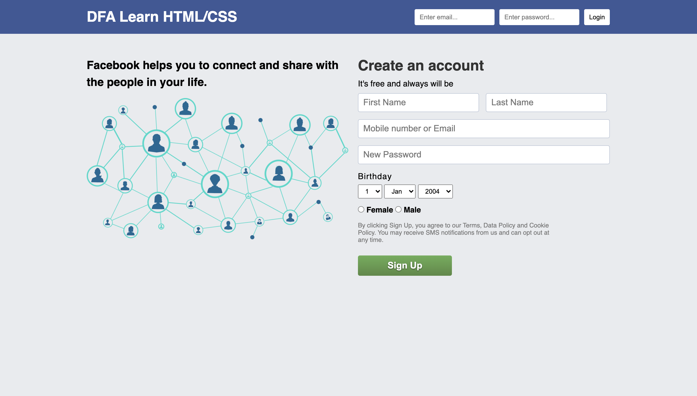

# Web Fundamentals Mini Group Activity - Facebook Sign Up Clone

Make a clone of the old Facebook sign up page! Do this as a peer-group programming activity. No functionality is required, it just should mirror the file you can see!

## Your Target

Make an exact replica of the old Facebook sign up page:

## Rules

There will be varying experience with HTML and CSS in your group and to make it so everyone can contribute with what's been learned so far, the following rules are in place:

1) Only "Vanilla" HTML and CSS can be used. ***No frameworks or libraries***
2) No JavaScript is required - no functionality is needed for the form
3) There is no need for the page to be responsive
4) The page should be built in a single HTML file and a single CSS file
